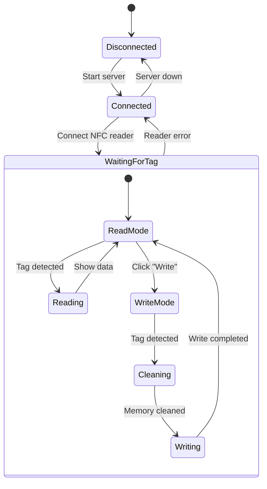

# NFC Reader/Writer for NTAG215 🚀

## Hi there! 👋
Welcome to this project! Here you'll find an application that lets you read and write data to your NTAG215 NFC tags in a super simple way. We built it with the community in mind, so we hope you'll find it useful.

## What can you do with this app? 🤔
- Read the UID and stored data from your NTAG215 tags
- Write texts up to 500 characters (lots of space!)
- The app automatically cleans memory before writing (no mixed data!)
- Super simple web interface
- Everything in real-time!

## How does it work? 🔄

The application uses a client-server architecture with WebSocket for real-time communication. Here's the workflow:

### State Diagram


### Reading Process 📖
1. WebSocket server listens on port 3000
2. NFC reader constantly monitors for tag presence
3. When a tag is detected:
   - Reads the UID
   - Reads user memory (pages 4-129)
   - Sends data to web client
   - Displays information on screen

### Writing Process ✍️
1. User enters text to write
2. When clicking "Write to NFC":
   - Validates text length (max 500 characters)
   - Waits for tag presence
3. When tag is detected:
   - Cleans all user memory
   - Writes new data page by page
   - Confirms successful write

### Real-Time Communication 🔌
- WebSocket maintains bidirectional connection
- NFC reader events are transmitted instantly
- Web interface updates automatically
- Real-time error handling

## What you need to get started 🛠️

### Required Hardware
- An ACR1251U NFC reader
- NTAG215 NFC tags
- A free USB port on your computer

### Required Software
- Node.js (version 12.0.0 or newer)
- npm (comes with Node.js, so don't worry!)
- Your operating system can be:
  - Windows 10/11
  - Linux (Ubuntu 18.04 or newer)
  - macOS (10.15 or newer)
- A current web browser (Chrome, Firefox, Edge, whatever you prefer!)

### Drivers (important!)
- You'll need the [ACR1251U drivers](https://www.acs.com.hk/en/driver/3/acr1251-usb-nfc-reader/)
  - If you use Windows: Download the ACR1251U Driver Installer
  - If you use Linux: You need the PC/SC driver (libpcsclite-dev)
  - If you use macOS: You're in luck! You don't need anything additional

## How do I get it running? 🚀

1. First, clone the repo:
```bash
git clone [repository-url]
cd [directory-name]
```

2. Install everything needed:
```bash
npm install
```

3. If you're on Linux, you need these permissions (just once!):
```bash
sudo apt-get install libpcsclite-dev
sudo usermod -a -G plugdev $USER
```

4. Start the server!:
```bash
node server.js
```

5. Open the `index.html` file in your favorite browser and you're ready!

## Let's use it! 🎮

### Reading tags

1. Connect your ACR1251U reader
2. Wait for the "NFC Reader Connected" message
3. Place your NTAG215 tag near the reader
4. Magic! You'll see all the info on your screen

[INSERT IMAGE - A screenshot showing the UID and tag data with a friendly interface]

### Writing to tags

1. Write the text you want to save to the tag
2. Click "Write to NFC"
3. When prompted, place your tag near the reader
4. Wait a moment while everything saves!

[INSERT IMAGE - A screenshot showing how it looks when you successfully write data]

## Some important tips 💡
- The app automatically cleans the tag before writing (no mixed data!)
- You can write up to 500 characters (lots of text!)
- Keep the tag steady near the reader while writing
- Be patient and don't remove it until it tells you everything is ready

## Join the community! 🤝

Hey! This is an open-source project and we made it thinking of you and the whole dev community. Got ideas to improve it? Go ahead! You can:

- Report bugs (we all have them 🐛)
- Propose new features
- Share how you're using it
- Tell us about your experience
- Or just drop by to say hi!

The NFC community is growing and we want you to be part of it! Every contribution counts, and your experience can help other devs who are just starting.

## License
MIT License - Use it, modify it, and share it however you want!

---
Made with ❤️ by and for the dev community
Questions? Suggestions? We're here to help! 