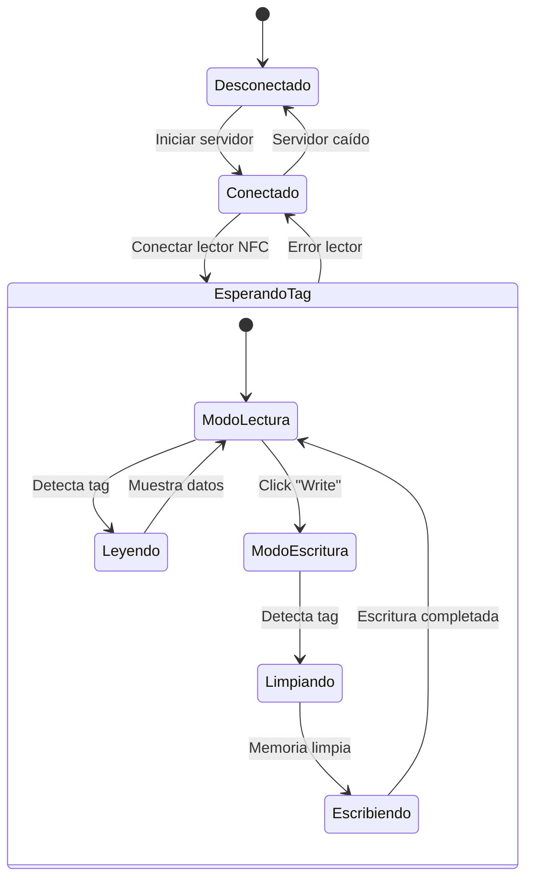

# Lector/Escritor NFC para NTAG215 🚀

## ¡Hola! 👋
¡Bienvenido/a a este proyecto! Aquí encontrarás una aplicación que te permitirá leer y escribir datos en tus tags NFC NTAG215 de una manera súper sencilla. La hemos construido pensando en la comunidad, así que esperamos que te sea útil.

## ¿Qué puedes hacer con esta app? 🤔
- Leer el UID y los datos guardados en tus tags NTAG215
- Escribir textos de hasta 500 caracteres (¡un montón de espacio!)
- La app limpia automáticamente la memoria antes de escribir (así evitamos datos mezclados)
- Tiene una interfaz web súper simple de usar
- ¡Todo en tiempo real!

## ¿Cómo funciona? 🔄

La aplicación utiliza una arquitectura cliente-servidor con WebSocket para comunicación en tiempo real. Aquí te explico el flujo de trabajo:

### Diagrama de Estados


### Proceso de Lectura 📖
1. El servidor WebSocket espera conexiones en el puerto 3000
2. El lector NFC monitorea constantemente la presencia de tags
3. Cuando detecta un tag:
   - Lee el UID
   - Lee la memoria de usuario (páginas 4-129)
   - Envía los datos al cliente web
   - Muestra la información en pantalla

### Proceso de Escritura ✍️
1. El usuario ingresa el texto a escribir
2. Al hacer click en "Write to NFC":
   - Valida la longitud del texto (máx. 500 caracteres)
   - Espera que se acerque un tag
3. Cuando detecta el tag:
   - Limpia toda la memoria de usuario
   - Escribe los nuevos datos página por página
   - Confirma la escritura exitosa

### Comunicación en Tiempo Real 🔌
- WebSocket mantiene una conexión bidireccional
- Los eventos del lector NFC se transmiten instantáneamente
- La interfaz web se actualiza automáticamente
- Manejo de errores en tiempo real

## Lo que necesitas para empezar 🛠️

### Hardware necesario
- Un lector NFC ACR1251U
- Tags NFC NTAG215
- Un puerto USB libre en tu computadora

### Software necesario
- Node.js (versión 12.0.0 o más nueva)
- npm (viene con Node.js, ¡así que no te preocupes!)
- Tu sistema operativo puede ser:
  - Windows 10/11
  - Linux (Ubuntu 18.04 o más nuevo)
  - macOS (10.15 o más nuevo)
- Un navegador web actual (Chrome, Firefox, Edge, ¡el que prefieras!)

### Drivers (¡importante!)
- Necesitarás los [drivers del ACR1251U](https://www.acs.com.hk/en/driver/3/acr1251-usb-nfc-reader/)
  - Si usas Windows: Descarga el ACR1251U Driver Installer
  - Si usas Linux: Necesitas el PC/SC driver (libpcsclite-dev)
  - Si usas macOS: ¡Estás de suerte! No necesitas nada adicional

## ¿Cómo lo pongo a funcionar? 🚀

1. Primero, clona el repo:
```bash
git clone [url-del-repositorio]
cd [nombre-del-directorio]
```

2. Instala todo lo necesario:
```bash
npm install
```

3. Si estás en Linux, necesitas estos permisos (¡solo una vez!):
```bash
sudo apt-get install libpcsclite-dev
sudo usermod -a -G plugdev $USER
```

4. ¡Arranca el servidor!:
```bash
node server.js
```

5. Abre el archivo `index.html` en tu navegador favorito y ¡listo!

## ¡Vamos a usarla! 🎮

### Para leer tags

1. Conecta tu lector ACR1251U
2. Espera a ver el mensaje "Lector NFC conectado"
3. Acerca tu tag NTAG215 al lector
4. ¡Magia! Verás toda la info en tu pantalla

[INSERTAR IMAGEN - Una captura donde se vea el UID y los datos del tag, con una interfaz amigable]

### Para escribir en los tags

1. Escribe el texto que quieras guardar en el tag
2. Dale click a "Write to NFC"
3. Cuando te lo pida, acerca tu tag al lector
4. ¡Espera un momentito mientras se guarda todo!

[INSERTAR IMAGEN - Una captura mostrando cómo se ve cuando escribes datos exitosamente]

## Algunos tips importantes 💡
- La app limpia automáticamente el tag antes de escribir (¡así evitamos datos revueltos!)
- Puedes escribir hasta 500 caracteres (¡bastante texto!)
- Mantén el tag quieto cerca del lector mientras escribes
- Ten paciencia y no lo quites hasta que te diga que todo está listo

## ¡Únete a la comunidad! 🤝

¡Hey! Este proyecto es de código abierto y lo hicimos pensando en ti y en toda la comunidad dev. ¿Tienes ideas para mejorarlo? ¡Adelante! Puedes:

- Reportar bugs (todos los tenemos 🐛)
- Proponer nuevas funciones
- Compartir cómo lo estás usando
- Contar tu experiencia
- ¡O simplemente pasar a saludar!

La comunidad NFC en español está creciendo y ¡queremos que seas parte! Cada granito de arena cuenta, y tu experiencia puede ayudar a otros devs que están empezando.

## Licencia
MIT License - ¡Úsalo, modifícalo y compártelo como quieras!

---
Hecho con ❤️ por y para la comunidad dev
¿Dudas? ¿Sugerencias? ¡Estamos para ayudarte! 